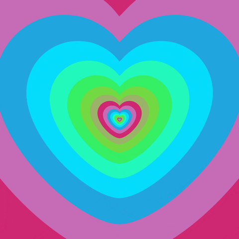

<h1 align="center">
  valentines
  <a href="love.gif">
    
</a><br>
  <br>

</h1>

<div align="center">
   <strong>valentines</strong> -for long distance besties<br>
   <br> <br>
  
</div>
<hr>

<details>
<summary>table of contents</summary>

- [vibe](#vibe)
- [links](#links)
- [tech stack](#tech-stack)

- [future](#future)

- [setup my proj on ur device](#setup-my-proj-on-ur-device)

- [about me](#about-me)


</details>

## 📝vibe

a cuter way to make plans and make ur bestie feel special 

## 🔗links

- [gitHub repo](https://github.com/xoaryaa/valentines)
- [doc containing site imgs](https://drive.google.com/drive/u/0/folders/18GDyVr_rgMHnz-6PHbo7ldhalTn6KKbX)


## 🤖tech stack


#### frontend
- HTML
- CSS
- JavaScript


## 🔮future


- to make real restaurant reservations
- to send reminder mail of the planned dinner


## 🛠setup my proj on ur device


`write the following commands on the terminal.`


1. Clone the project

```bash
git clone https://github.com/xoaryaa/valentines.git
```

2. Go to the project directory

```bash
cd valentines
```

3. Install dependencies

```bash
npm install
```

4. Start the server

```bash
npm start
```


## 👨‍💻about me


- [arya](https://github.com/xoaryaa): arya.tayshete72@gmail.com


ok bye!
dont forget to love ur bestie(and annoy them)

